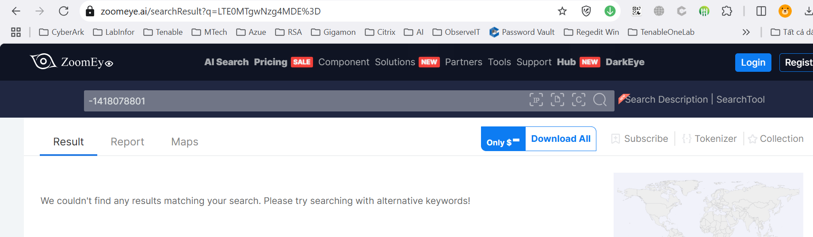

# CTF Write-Up: Baby Recon

## Mô tả bài thử thách  

Bài thử thách tại [viblo](https://ctf.viblo.asia/) với tên Challenge là Baby Recon  

Đề bài như sau: 
  

Đây là đề bài thuộc thể loại OSINT. OSINT viết tắt của Open Source Intelligence. Thể loại OSINT yêu cầu :  

-   Tìm kiếm thông tin có sẵn trên Internet: từ website, social media, ảnh, domain, địa chỉ IP, hash, database leak,...  

-   Không hack, không exploit, chỉ dùng kỹ năng truy vết và phân tích dữ liệu công khai.  

-   Sử dụng công cụ, kỹ thuật tìm kiếm chuyên sâu như: Google dorking, Shodan, FOFA, whois, theHarvester, Maltego, tinEye,...  

Quay lại đề bài của chúng ta, tài nguyên được cung cấp là file favicon.zip, giải nén file này ra ta được file favicon.ico  
Hehe ngay từ cái tên file đã cho chúng ta gợi ý rồi. Favicon - Viết tắt của từ favorite icon, là một hình ảnh hay biểu tượng nhỏ nằm ở đầu mỗi tab trên trình duyệt web như một logo đại diện cho mỗi website. Nó còn được gọi là biểu tượng của trang web (website icon), biểu tượng của tab (tab icon) hay bookmark (bookmark icon)…  

### Ý tưởng khai thác  
Đề bài yêu cầu Submit flag theo định dạng: Flag{Country_CloudProvider}   (Ví dụ: Flag{Laos_KamateraCloud})  
Thêm vào dữ kiện favicon, chúng ta có thể suy đoán file này sẽ là logo của một trang web nào đó mà đề bài muốn submit country và couldprovider nên mục tiêu của chúng ta sẽ là tìm ra logo này thuộc trang web nào, sau đó xem địa chỉ IP của trang web rồi cuối cùng từ địa chỉ IP tìm ra country và cloudprovider.  
Một file bất kỳ (ví dụ file ảnh favicon.ico) khi được tạo ra sẽ có một mã hash duy nhất (ví dụ: MD5, SHA1, SHA256).Một file favicon có thể nhìn giống file khác nhưng bên trong khác chút xíu (ví dụ metadata khác, dung lượng khác).Nếu chỉ nhìn ảnh bằng mắt, bạn sẽ không đảm bảo nó là cùng 1 file 100% ==> Ý tưởng sẽ tìm mã hash của file favicon này sau đó dùng các công cụ như Shodan, zoomeye, censys,...

Ok bắt đầu thực chiến nào!  
Trước tiên cần tìm mã hash của file favicon.ico này đã, hash thì có nhiều loại hash tuy nhiên trong giới OSINT và CTF, MMH3 hay được dùng để hash favicon.ico vì các công cụ tìm kiếm bảo mật lớn như Shodan, FOFA, Censys, ZoomEye...đều lưu trữ hash favicon dưới dạng MMH3!  
Có nhiều cách tính hash mmh3 của một file, tuy nhiên mình thích cây nhà lá vườn nên sẽ viết 1 đoạn python để tính hash  

  

Mã hash của file favicon.ico trên là `-1418078801`  
Tiếp đến dùng các công cụ như shodan, zoomeye, censys... để tìm xem favicon này là của trang web nào!  
Bắt đầu với công cụ cực kỳ nổi tiếng - Shodan  
Truy cập vào shodan và dán mã hash của favicon và tìm kiếm, tuy nhiên không may mắn lắm, đã không tìm thấy kết quả từ shodan  

  

Không nản ! Thử tìm ở công cụ khác nào. Lần này đổi sang zoomeye  

   
Èo vẫn không có kết quả ! Thử sang công cụ censys  

  
Lần này thì bắt được đối tượng tình nghi! IP của website là 172.104.49.143  
Tiếp đến thì đơn giản rồi, chúng ra truy cập vào trang [ipinfo](https://ipinfo.io/) này để tìm thông tin của server.  
  
Đến đây thì đi submit flag thôi. Flag{Singapore_Linode}
